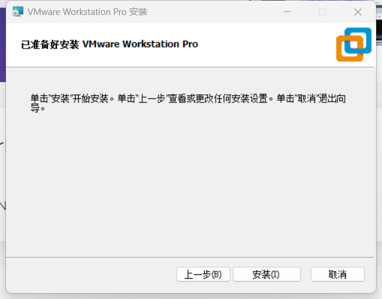
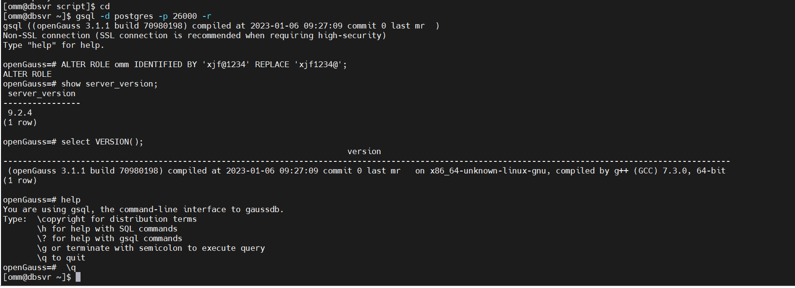

> 更新时间：2024/03/16

### 安装VMware Workstation虚拟化软件
<br>可以在[官方网页](https://www.VMware.com/cn/products/workstation-pro/workstation-pro-evaluation.html)下载VMware Workstation pro虚拟化软件的测试版：
<br>
<br>从VMware官网下载Workstation 17 Pro试用版软件后，然后用鼠标左键双击VMware Workstation软件介质开始安装。一直下一步即可，到最后就可以点击安装。
<br>
<br>安装完成后结果如下：
<br>

### 在openEuler虚拟机中静默安装openGauss数据库
#### 前置准备
<br>使用root用户，执行下面的命令，停止和关闭防火墙：

```bash
### 停止firewall
systemctl stop firewalld.service
### 禁止firewall开机启动
systemctl disable firewalld.service
```
<br>在Linux终端，用Linux超级用户root，执行下面的命令，关闭SELinux：

```bash
### 关闭SELinux，需要重启动
getenforce
sed -i 's/^SELINUX=.*/SELINUX=disabled/' /etc/selinux/config
setenforce 0
getenforce
```

<br>
<br>使用root用户，编辑文件/etc/profile.d/performance.sh：
将下面的行：
sysctl -w vm.min_free_kbytes=112640 &> /dev/null
修改为（在行的开始处添加一个#，注释掉该行）：
#sysctl -w vm.min_free_kbytes=112640 &> /dev/null
<br>修改完成后，按Ctrl+x组合键，再按字母Y和回车键保存文件。
<br>

<br>使用root用户，执行下面的脚本，修改openEuler的内核参数，以满足安装openGauss数据库的要求:

```bash
cat >> /etc/sysctl.conf << EOF
net.ipv4.tcp_max_tw_buckets = 10000
net.ipv4.tcp_tw_reuse = 1
net.ipv4.tcp_tw_recycle = 1
net.ipv4.tcp_keepalive_time = 30
net.ipv4.tcp_keepalive_probes = 9
net.ipv4.tcp_keepalive_intvl = 30
net.ipv4.tcp_retries1 = 5
net.ipv4.tcp_syn_retries = 5
net.ipv4.tcp_synack_retries = 5
net.sctp.path_max_retrans = 10
net.sctp.max_init_retransmits = 10
net.sctp.association_max_retrans = 10
net.sctp.hb_interval = 30000
net.ipv4.tcp_retries2 = 12
vm.overcommit_memory = 0
net.sctp.sndbuf_policy = 0
net.sctp.rcvbuf_policy = 0
net.sctp.sctp_mem = 94500000 915000000 927000000
net.sctp.sctp_rmem = 8192 250000 16777216
net.sctp.sctp_wmem = 8192 250000 16777216
net.ipv4.tcp_rmem = 8192 250000 16777216
net.ipv4.tcp_wmem = 8192 250000 16777216
net.core.wmem_max = 21299200
net.core.rmem_max = 21299200
net.core.wmem_default = 21299200
net.core.rmem_default = 21299200
net.ipv4.ip_local_port_range = 26000 65535
kernel.sem = 250 6400000 1000 25600
vm.min_free_kbytes = 419430 ##suggest to set as physical memory * 5%
net.core.somaxconn = 65535
net.ipv4.tcp_syncookies = 1
net.sctp.addip_enable = 0
net.core.netdev_max_backlog = 65535
net.ipv4.tcp_max_syn_backlog = 65535
net.ipv4.tcp_fin_timeout = 60
kernel.shmall = 1152921504606846720
kernel.shmmax = 18446744073709551615
net.ipv4.tcp_sack = 1
net.ipv4.tcp_timestamps = 1
vm.extfrag_threshold = 500
vm.overcommit_ratio = 90
net.ipv4.ip_local_reserved_ports = 20050-20057,26000-26007
net.sctp.sctp_mem = 94500000 915000000 927000000
net.sctp.sctp_rmem = 8192 250000 16777216
net.sctp.sctp_wmem = 8192 250000 16777216
net.ipv4.tcp_retries1 = 5
net.ipv4.tcp_syn_retries = 5
net.sctp.path_max_retrans = 10
net.sctp.max_init_retransmits = 10
net.ipv4.tcp_fin_timeout = 60
EOF
```
<br>使用root用户，执行下面的命令，配置用户堆栈限制、打开文件数限制、用户可打开的最大进程数限制：

```bash
echo "* soft stack 3072" >> /etc/security/limits.conf
echo "* hard stack 3072" >> /etc/security/limits.conf
echo "* soft nofile 1000000" >>/etc/security/limits.conf
echo "* hard nofile 1000000" >>/etc/security/limits.conf
echo "* soft nproc unlimited" >> /etc/security/limits.d/90-nproc.conf
echo "* hard nproc unlimited" >> /etc/security/limits.d/90-nproc.conf
tail -n 4 /etc/security/limits.conf
tail -n 1 /etc/security/limits.d/90-nproc.conf
```
<br>说明：

- 1）	hard表示硬限制，soft表示软限制，软限制要小于等于硬限制。
- 2）	nofile表示任何用户能打开的最大文件数量，不管他开启多少个shell，此处为1000000。
- 3）	nproc用来限制每个用户的最大processes数量，此处无限制。
<br>使用root用户，执行下面的命令，关闭openEulor的RemoveIPC：

```bash
sed -i '/^RemoveIPC/d' /usr/lib/systemd/system/systemdlogind.service
echo "RemoveIPC=no" >> /etc/systemd/logind.conf
echo "RemoveIPC=no" >> /usr/lib/systemd/system/systemdlogind.service
systemctl daemon-reload
systemctl restart systemd-logind
loginctl show-session | grep RemoveIPC
systemctl show systemd-logind | grep RemoveIPC
```
<br>
<br>使用root用户，执行下面的命令，设置Python默认的版本为python3：

```bash
cd /usr/bin
mv python python.bak
ln -s python3 /usr/bin/python
python -V
```
<br>使用root用户，执行下面的命令，创建Linux用户组dbgrp和Linux用户omm，并为用户omm设置密码为omm123：

```bash
groupadd  dbgrp -g 2000
useradd omm -g 2000 -u 2000
echo "omm123"|passwd --stdin omm
```
<br>使用root用户，执行下面的命令，创建存放openGauss数据库管理系统软件介质的目录：

```bash
mkdir -p /opt/software/openGauss
chmod -R 755 /opt/software
chown -R omm.dbgrp /opt/software
```
<br>将openGauss介质上传到openEuler容器。
<br>
<br>使用omm用户，执行下面的命令，解压缩openGauss数据库软件二进制安装包：

```bash
cd /opt/software/openGauss
tar zxf openGauss-3.1.1-openEuler-64bit-all.tar.gz
tar zxf openGauss-3.1.1-openEuler-64bit-om.tar.gz
```
<br>
<br>使用omm用户，执行下面的脚本，生成安装openGauss数据库的xml配置文件：

```bash
cd /opt/software/openGauss
cat > clusterconfig.xml<<EOF 
<?xml version="1.0" encoding="UTF-8"?>
<ROOT>
    <!-- openGauss整体信息 -->
    <CLUSTER>
        <!-- 数据库名称 -->
        <PARAM name="clusterName" value="dbCluster" />
        <!-- 数据库节点名称(hostname) -->
        <PARAM name="nodeNames" value="fb5aff2634ca" />
        <!-- 数据库安装目录-->
        <PARAM name="gaussdbAppPath" value="/opt/huawei/install/app" />
        <!-- 日志目录-->
        <PARAM name="gaussdbLogPath" value="/var/log/omm" />
        <!-- 临时文件目录-->
        <PARAM name="tmpMppdbPath" value="/opt/huawei/tmp" />
        <!-- 数据库工具目录-->
        <PARAM name="gaussdbToolPath" value="/opt/huawei/install/om" />
        <!-- 数据库core文件目录-->
        <PARAM name="corePath" value="/opt/huawei/corefile" />
        <!-- 节点IP，与数据库节点名称列表一一对应 -->
        <PARAM name="backIp1s" value="172.17.0.2"/> 
    </CLUSTER>
    <!-- 每台服务器上的节点部署信息 -->
    <DEVICELIST>
        <!-- 节点1上的部署信息 -->
        <DEVICE sn="1000001">
            <!-- 节点1的主机名称 -->
            <PARAM name="name" value="fb5aff2634ca"/>
            <!-- 节点1所在的AZ及AZ优先级 -->
            <PARAM name="azName" value="AZ1"/>
            <PARAM name="azPriority" value="10"/>
            <!-- 节点1的IP，如果服务器只有一个网卡，将backIP1和sshIP1配置成同一个IP -->
            <PARAM name="backIp1" value="172.17.0.2"/>
            <PARAM name="sshIp1" value="172.17.0.2"/>
	    <!--dbnode-->
	    <PARAM name="dataNum" value="1"/>
	    <PARAM name="dataPortBase" value="26000"/>
	    <PARAM name="dataNode1" value="/opt/huawei/install/data/fb5aff2634ca"/>
            <PARAM name="dataNode1_syncNum" value="0"/>
        </DEVICE>
    </DEVICELIST>
</ROOT>
EOF
```
<br>使用omm用户，使用nano编辑/home/omm/.bashrc文件：

```bash
nano /home/omm/.bashrc
```

在文件末尾添加如下的行:
```bash
export LD_LIBRARY_PATH=/opt/software/openGauss/script/gspylib/clib:$LD_LIBRARY_PATH
```
修改完成后，按Ctrl+x组合键，再按字母Y和回车键保存文件。
<br>临时关闭openEuler的交换区，如果不关闭openEuler的交换区，华为openGauss数据库管理系统的安装前检查将没法正常通过!
<br>执行`free -g`命令，查看系统的交换区大小
<br>执行`swapoff -a`命令，临时关闭openEuler的交换区：
可以看到系统的交换区已经都被关闭了，目前系统交换区的大小为0了。
<br>
<br>使用root用户，执行下面的命令，进行安装openGauss数据库之前的交互式检查：

```bash
cd /opt/software/openGauss/script
./gs_preinstall -U omm -G dbgrp -X /opt/software/openGauss/clusterconfig.xml 
```
<br>
<br>检查完成之后，可以使用root用户，执行下面的命令，查看具体的检查信息：

```bash
/opt/software/openGauss/script/gs_checkos -i A -h dbsvr --detail
```
<br>
<br>可以看到，检查的结果是，没有任何的不正常，只有2个警告，警告不会影响openGauss数据库的安装。
<br>使用root用户，执行下面的命令，修改目录的权限：

```bash
chown -R omm:dbgrp /opt/software
ln -s /usr/lib64/libreadline.so.8 /usr/lib64/libreadline.so.7
```
<br>安装openGauss DBMS和创建openGauss数据库，需要使用omm用户，因此执行下面的命令切换到用户omm,使用omm用户，拷贝安装openGauss数据库管理系统的xml配置文件：

```bash
su omm
cd /opt/software/openGauss/script
cp ../clusterconfig.xml .
```
<br>我们当前使用的openEuler虚拟机dvsvr，内存较小（4GB），因此需要使用omm用户，执行下面的命令，来安装和创建openGauss数据库：

```bash
cd /opt/software/openGauss/script
gs_install -X /opt/software/openGauss/script/clusterconfig.xml \
--gsinit-parameter="--encoding=UTF8" \
--dn-guc="max_connections=1000" \
--dn-guc="max_process_memory=3GB" \
--dn-guc="shared_buffers=128MB" \
--dn-guc="bulk_write_ring_size=128MB" \
--dn-guc="cstore_buffers=16MB"

```
<br>
<br>使用omm用户，执行下面的命令，登录到openGauss数据库中：

```bash
cd 
gsql -d postgres -p 26000 -r
ALTER ROLE omm IDENTIFIED BY 'xjf@1234' REPLACE 'xjf1234@';
show server_version;
select VERSION();
help
\q
```
<br>
<br>由此，openGauss数据库安装成功