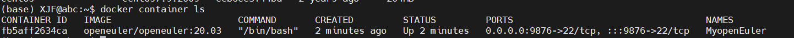
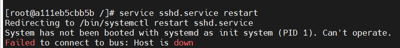

> 更新时间：2024/03/03
### 在Ubuntu上配置openEuler的docker镜像

#### 获取镜像

从 [Docker 镜像仓库](https://hub.docker.com/)获取openEuler镜像其命令格式为：
```
docker pull openeuler/openeuler:20.03
```

可以使用``docker image ls``查看已经下载下来的镜像


#### 基于镜像启动容器
根据如下命令新建并启动openEuler容器
```
docker run --name MyopenEuler -d -t -i openeuler/openeuler:20.03 /bin/bash
```

其中，--name为容器指定一个名称，-t 选项让Docker分配一个伪终端（pseudo-tty）并绑定到容器的标准输入上， -i 则让容器的标准输入保持打开，-d可以让docker容器直接在服务器后台运行。

启动容器后，可以使用命令``docker container ls``查看启动的容器。



当容器启动后，可以使用如下命令进入容器：

```
docker exec -it MyopenEuler bash
```

只用 -i 参数时，由于没有分配伪终端，界面没有我们熟悉的 Linux 命令提示符，但命令执行结果仍然可以返回。
当 -i -t 参数一起使用时，则可以看到我们熟悉的 Linux 命令提示符。


#### 使用MobaXterm在Win11上远程连接服务器创建的openEuler容器

**1.为openEuler容器的root用户创建密码**
<br>

使用命令``passwd``修改/创建root用户的密码。


**2.为openEuler容器安装ssh服务**

使用命令``yum -y install openssh-server``安装ssh服务，安装结果如下：


**3.在宿主机上通过ssh连接docker容器**

使用命令``ssh root@0.0.0.0 -p 9876``通过宿主机连接docker容器，结果如下：


**4.完成无密码ssh连接**

根据如下命令，创建.ssh文件夹

```
[root@fb5aff2634ca ~]# cd
[root@fb5aff2634ca ~]# mkdir .ssh
```

然后使用命令``vi /etc/ssh/sshd_config``编辑/etc/ssh/sshd_config文件,修改以下内容：

第1处修改:

```
#PubkeyAuthentication yes
修改为（去掉注释符号#）
PubkeyAuthentication yes
```

第2处修改:

```
#AllowAgentForwarding yes
#AllowTcpForwarding yes
修改为（去掉注释符号#）
AllowAgentForwarding yes
AllowTcpForwarding yes
```

然后使用命令``systemctl restart sshd.service``重启ssh服务。

使用如下命令,可以实现ssh无密码登录
```
[root@fb5aff2634ca ~]# cd .ssh/
[root@fb5aff2634ca .ssh]# vi id_ed25519.pub
[root@fb5aff2634ca .ssh]# cat id_ed25519.pub >>authorized_keys
[root@fb5aff2634ca .ssh]# ls
authorized_keys  id_ed25519.pub
[root@fb5aff2634ca .ssh]# chmod 600 authorized_keys
[root@fb5aff2634ca .ssh]# cd ..
[root@fb5aff2634ca ~]# chmod 700 .ssh
```

登录结果如下：


**5.使用MobeXterm连接服务器的docker容器**

在MobeXterm上进行如下配置


之后就可以成功通过MobeXterm进行连接了。


### 遇到的问题与解决方案

1.之前启动容器的时候没有暴露容器与服务器之间的端口。

解决方案如下：

网上查询发现docker的容器一旦生成，就没有一个命令可以直接修改或者添加端口映射，因此只能创建一个新的容器，此时的命令如下：
```
docker run --name MyopenEuler -p 9876:22 -d -t -i openeuler/openeuler:20.03 /bin/bash
```
执行这条命令后，再次使用``docker container ls``可以发现此时port显示出了端口映射。

2.使用passwd修改root密码时出现了``bash: passwd: command not found``错误

解决方案如下：

使用如下命令安装passewd

```
yum install passwd
```


3.docker容器更新sshd_config报错


根据图片上的描述，可以发现应该是systemctl命令无法在docker中正常使用。

解决方案如下：

首先下载python2
```
yum install python27
```
然后从 [GitHub](https://github.com/gdraheim/docker-systemctl-replacement/blob/master/files/docker/systemctl.py)获取可以替代systemctl的文件，将该文件放入`/usr/bin/systemctl`中。
最后，使用`chmod a+x /bin/systemctl`命令，可以解决问题3中service和systemctl无法更新config文件的问题。

4.当可以使用systemctl命令之后，发现使用命令``systemctl status sshd.service``之后显示ssh的Activate状态是false。


解决方案如下：

使用``sshd -t``命令检查，发现问题原因是：

解决这个问题，可以使用如下命令：
```
ssh-keygen -t rsa -f /etc/ssh/ssh_host_rsa_key
ssh-keygen -t ecdsa -f /etc/ssh/ssh_host_ecdsa_key
ssh-keygen -t ed25519 -f /etc/ssh/ssh_host_ed25519_key
```

使用上述命令后，可以发现问题4已经解决，当前状态已经是running了。
