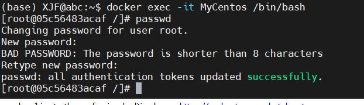
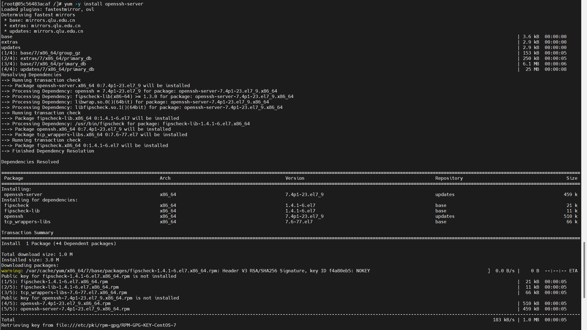
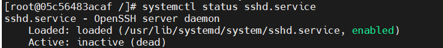
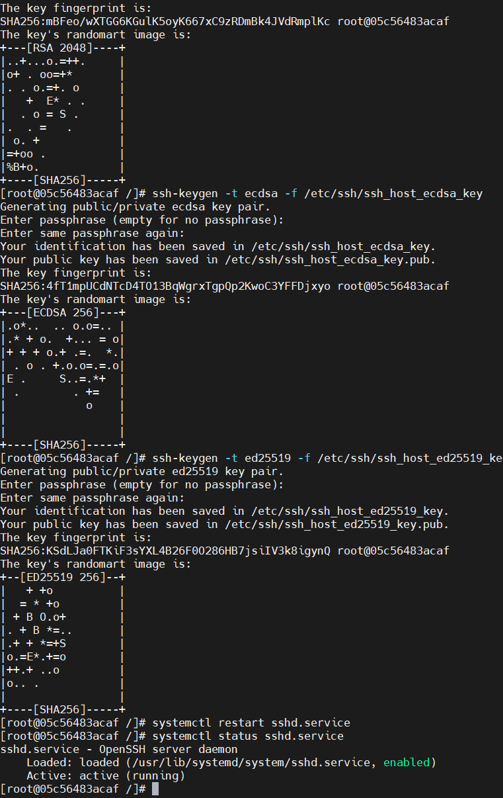
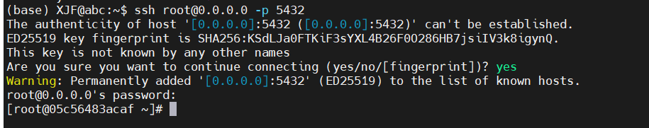
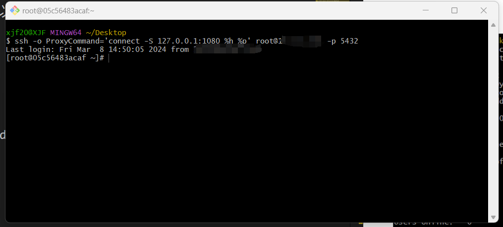
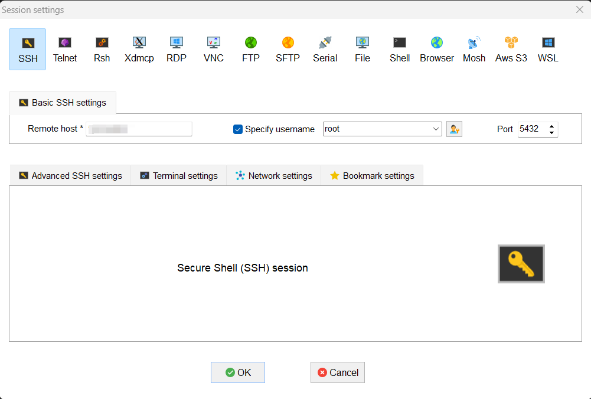
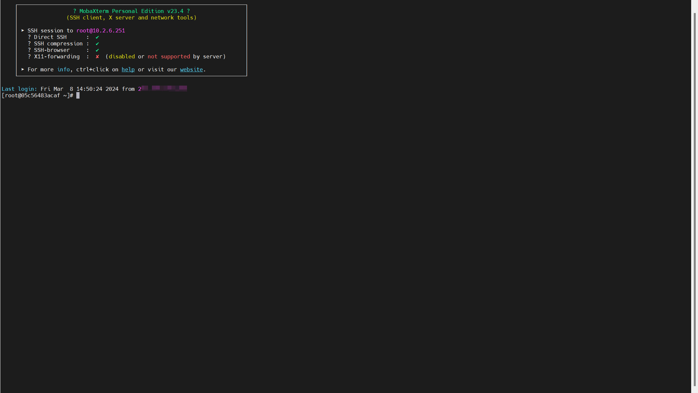

> 更新时间：2024/03/08

### 在Ubuntu上配置centos7.9的docker镜像

#### 获取镜像

从 [Docker 镜像仓库](https://hub.docker.com/)获取openEuler镜像其命令格式为：

```bash
docker pull centos:centos7.9.2009
```

<br>可以使用``docker image ls``查看已经下载下来的镜像


#### 基于镜像启动容器

根据如下命令新建并启动openEuler容器

```bash
docker run --name MyCentos -p 5432:22 -d -t -i centos:centos7.9.2009 /bin/bash
```

<br>其中，--name为容器指定一个名称，-t 选项让Docker分配一个伪终端（pseudo-tty）并绑定到容器的标准输入上， -i 则让容器的标准输入保持打开，-d可以让docker容器直接在服务器后台运行。

<br>启动容器后，可以使用命令``docker container ls``查看启动的容器。

<br>

<br>当容器启动后，可以使用如下命令进入容器：

```bash
docker exec -it MyCentos /bin/bash
```

#### 使用MobaXterm在Win11上远程连接服务器创建的centos7.9容器

**1.为centos7.9容器的root用户创建密码**

<br>使用命令``passwd``修改/创建root用户的密码。

<br>

<br>**2.为centos7.9容器安装ssh服务**

<br>使用命令``yum -y install openssh-server``安装ssh服务，安装结果如下：

<br>

<br>**3.在宿主机上通过ssh连接docker容器**

<br>首先更换systemctl的文件，具体过程如下：

- 从 [GitHub](https://github.com/gdraheim/docker-systemctl-replacement/blob/master/files/docker/systemctl.py)获取可以替代systemctl的文件，将该文件放入`/usr/bin/systemctl`中。
- 使用`chmod a+x /bin/systemctl`命令，可以解决问题中service和systemctl无法更新config文件的问题。
- 使用命令`systemctl status sshd.service`确认systemctl文件已经可以使用了。
<br>

<br>使用下面三条命令，然后使用`systemctl restart sshd.service`激活ssh：

```bash
ssh-keygen -t rsa -f /etc/ssh/ssh_host_rsa_key
ssh-keygen -t ecdsa -f /etc/ssh/ssh_host_ecdsa_key
ssh-keygen -t ed25519 -f /etc/ssh/ssh_host_ed25519_key
```


<br>使用命令``ssh root@0.0.0.0 -p 5432``通过宿主机连接docker容器，结果如下：

<br>

<br>**4.完成无密码ssh连接**

<br>根据如下命令，创建.ssh文件夹

```bash
[root@05c56483acaf /]# cd
[root@05c56483acaf ~]# mkdir .ssh
```

<br>然后使用命令``vi /etc/ssh/sshd_config``编辑/etc/ssh/sshd_config文件,修改以下内容：

<br>第1处修改:

```bash
#PubkeyAuthentication yes
#修改为（去掉注释符号#）
PubkeyAuthentication yes
```

<br>第2处修改:

```bash
#AllowAgentForwarding yes
#AllowTcpForwarding yes
#修改为（去掉注释符号#）
AllowAgentForwarding yes
AllowTcpForwarding yes
```

<br>然后使用命令``systemctl restart sshd.service``重启ssh服务。

<br>使用如下命令,可以实现ssh无密码登录
```bash
[root@05c56483acaf ~]# cd .ssh/
[root@05c56483acaf .ssh]# vi id_ed25519.pub
[root@05c56483acaf .ssh]# cat id_ed25519.pub >>authorized_keys
[root@05c56483acaf .ssh]# ls
authorized_keys  id_ed25519.pub
[root@05c56483acaf .ssh]# chmod 600 authorized_keys
[root@05c56483acaf .ssh]# cd ..
[root@05c56483acaf ~]# chmod 700 .ssh
```
<br>登录结果如下：

<br>

<br>**5.使用MobeXterm连接服务器的docker容器**

<br>在MobeXterm上进行如下配置

<br>

<br>之后就可以成功通过MobeXterm进行连接了。

<br>
