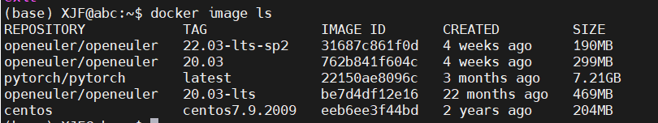
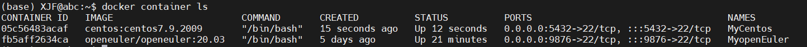

> 更新时间：2024/03/15

### 在Ubuntu上配置centos7.9的docker镜像

#### 获取镜像

从 [Docker 镜像仓库](https://hub.docker.com/)获取openEuler镜像其命令格式为：

```bash
docker pull centos:centos7.9.2009
```

<br>可以使用``docker image ls``查看已经下载下来的镜像


#### 基于镜像启动容器

根据如下命令新建并启动openEuler容器

```bash
docker run --name MyCentos -p 5432:22 -d -t -i centos:centos7.9.2009 /bin/bash
```

<br>其中，--name为容器指定一个名称，-t 选项让Docker分配一个伪终端（pseudo-tty）并绑定到容器的标准输入上， -i 则让容器的标准输入保持打开，-d可以让docker容器直接在服务器后台运行。

<br>启动容器后，可以使用命令``docker container ls``查看启动的容器。

<br>

<br>当容器启动后，可以使用如下命令进入容器：

```bash
docker exec -it MyCentos /bin/bash
```

#### 使用MobaXterm在Win11上远程连接服务器创建的centos7.9容器

**1.为centos7.9容器的root用户创建密码**

<br>使用命令``passwd``修改/创建root用户的密码。

<br>

<br>**2.为centos7.9容器安装ssh服务**

<br>使用命令``yum -y install openssh-server``安装ssh服务，安装结果如下：

<br>

<br>**3.在宿主机上通过ssh连接docker容器**

<br>首先更换systemctl的文件，具体过程如下：

- 从 [GitHub](https://github.com/gdraheim/docker-systemctl-replacement/blob/master/files/docker/systemctl.py)获取可以替代systemctl的文件，将该文件放入`/usr/bin/systemctl`中。
- 使用`chmod a+x /bin/systemctl`命令，可以解决问题中service和systemctl无法更新config文件的问题。
- 使用命令`systemctl status sshd.service`确认systemctl文件已经可以使用了。

<br>

<br>使用下面三条命令，然后使用`systemctl restart sshd.service`激活ssh：

```bash
ssh-keygen -t rsa -f /etc/ssh/ssh_host_rsa_key
ssh-keygen -t ecdsa -f /etc/ssh/ssh_host_ecdsa_key
ssh-keygen -t ed25519 -f /etc/ssh/ssh_host_ed25519_key
```


<br>使用命令``ssh root@0.0.0.0 -p 5432``通过宿主机连接docker容器，结果如下：

<br>

<br>**4.完成无密码ssh连接**

<br>根据如下命令，创建.ssh文件夹

```bash
[root@05c56483acaf /]# cd
[root@05c56483acaf ~]# mkdir .ssh
```

<br>然后使用命令``vi /etc/ssh/sshd_config``编辑/etc/ssh/sshd_config文件,修改以下内容：

<br>第1处修改:

```bash
#PubkeyAuthentication yes
#修改为（去掉注释符号#）
PubkeyAuthentication yes
```

<br>第2处修改:

```bash
#AllowAgentForwarding yes
#AllowTcpForwarding yes
#修改为（去掉注释符号#）
AllowAgentForwarding yes
AllowTcpForwarding yes
```

<br>然后使用命令``systemctl restart sshd.service``重启ssh服务。

<br>使用如下命令,可以实现ssh无密码登录
```bash
[root@05c56483acaf ~]# cd .ssh/
[root@05c56483acaf .ssh]# vi id_ed25519.pub
[root@05c56483acaf .ssh]# cat id_ed25519.pub >>authorized_keys
[root@05c56483acaf .ssh]# ls
authorized_keys  id_ed25519.pub
[root@05c56483acaf .ssh]# chmod 600 authorized_keys
[root@05c56483acaf .ssh]# cd ..
[root@05c56483acaf ~]# chmod 700 .ssh
```
<br>登录结果如下：

<br>

<br>**5.使用MobeXterm连接服务器的docker容器**

<br>在MobeXterm上进行如下配置

<br>

<br>之后就可以成功通过MobeXterm进行连接了。

<br>


### 在centos7.9容器中静默安装Oracle数据库
#### 前置准备
<br>使用如下命令关闭防火墙

```bash
systemctl disable firewalld.service 
systemctl stop firewalld.service
```

<br>安装环境依赖包

```bash
yum install -y binutils compat-libcap1 compat-libstdc++-33 compat-libstdc++-33.i686 glibc glibc.i686 glibc-devel glibc-devel.i686 ksh libaio libaio.i686 libaio-devel libaio-devel.i686 libX11 libX11.i686 libXau libXau.i686 libXi libXi.i686 libXtst libXtst.i686 libgcc libgcc.i686 libstdc++ libstdc++.i686 libstdc++-devel libstdc++-devel.i686 libxcb libxcb.i686 make nfs-utils net-tools smartmontools sysstat unixODBC unixODBC-devel gcc gcc-c++ libXext libXext.i686 zlib-devel zlib-devel.i686
```

<br>手动配置内核参数

```bash
echo "fs.file-max = 6815744
kernel.sem = 250 32000 100 128
kernel.shmmni = 4096
kernel.shmall = 1073741824
kernel.shmmax = 4398046511104
kernel.panic_on_oops = 1
net.core.rmem_default = 262144
net.core.rmem_max = 4194304
net.core.wmem_default = 262144
net.core.wmem_max = 1048576
net.ipv4.conf.all.rp_filter = 2
net.ipv4.conf.default.rp_filter = 2
fs.aio-max-nr = 1048576
net.ipv4.ip_local_port_range = 9000 65500
" >> /etc/sysctl.conf
```

<br>限制Oracle用户资源使用

```bash
echo "oracle   soft   nofile    1024
oracle   hard   nofile    65536
oracle   soft   nproc    16384
oracle   hard   nproc    16384
oracle   soft   stack    10240
oracle   hard   stack    32768
oracle   hard   memlock    134217728
oracle   soft   memlock    134217728
" >> /etc/security/limits.conf
```

<br>创建新用户和组

```bash
groupadd -g 10001 oinstall  #创建组用户安装数据库，组id：123456
groupadd -g 10002 dba       # 创建组dba用于管理数据库
groupadd -g 10003 oper      #
useradd -u 10001 -g oinstall -G dba,oper oracle #创建用户oracle，主组为oinstall，其他组为dba,oper
passwd oracle  #设置oracle用户密码为1
```
<br>

#### 配置安装环境

<br>使用如下命令创建Oracle安装目录

```bash
mkdir -p /usr/local/products/oracle12c
chown -R oracle:oinstall /usr/local
chmod -R 775 /usr/local/
```

<br>

<br>切换到oracle用户下操作,完成Oracle环境变量的配置并验证，首先在`/home/oracle/.bash_profile` 环境变量文件中添加如下内容：

```bash
export TMP=/tmp
export TMPDIR=$TMP

export ORACLE_HOSTNAME=05c56483acaf
export ORACLE_UNQNAME=orcl
export ORACLE_BASE=/usr/local/products
export ORACLE_HOME=$ORACLE_BASE/oracle12c
export ORACLE_SID=orcl

export PATH=/usr/sbin:/usr/local/bin:$PATH
export PATH=$ORACLE_HOME/bin:$PATH

export LD_LIBRARY_PATH=$ORACLE_HOME/lib:/lib:/usr/lib
export CLASSPATH=$ORACLE_HOME/jlib:$ORACLE_HOME/rdbms/jlib
```
<br>使用命令`source .bash_profile`使配置内容生效，并使用命令`echo $ORACLE_HOME`验证配置是否生效

<br>

<br>将Oracle12c的文件压缩包上传至docker并解压，可以得到database文件
<br>
<br>

#### 安装Oracle12C
<br>在database目录下执行下面的脚本

```bash
./runInstaller -ignoreSysPrereqs -ignorePrereq -waitforcompletion \
-showProgress -silent -responseFile /home/oracle/database/response/db_install.rsp \
oracle.install.option=INSTALL_DB_SWONLY \
UNIX_GROUP_NAME=oinstall \
INVENTORY_LOCATION=/usr/local/products/oracle12c/oraInventory \
ORACLE_HOME=/usr/local/products/oracle12c \
ORACLE_BASE=/usr/local/products \
oracle.install.db.InstallEdition=EE \
oracle.install.db.OSDBA_GROUP=dba \
oracle.install.db.OSBACKUPDBA_GROUP=dba \
oracle.install.db.OSDGDBA_GROUP=dba \
oracle.install.db.OSKMDBA_GROUP=dba \
oracle.install.db.OSRACDBA_GROUP=dba
```
<br>
<br>切换至root用户，执行下面的脚本

```bash
su
/usr/local/products/oracle12c/oraInventory/orainstRoot.sh
/usr/local/products/oracle12c/root.sh
```
<br>
<br>执行后切换回oracle用户，登录sqlplus成功，证明数据库安装成功
<br>

#### 创建Oracle数据库监听
<br>使用如下命令完成Oracle数据库监听：

```bash
netca -silent -responseFile /home/oracle/database/response/netca.rsp
```
<br>
<br>使用如下命令查看监听状态，如果结果如下图所示，则表示成功：
```bash
lsnrctl status
```
<br>

#### 创建数据库
<br>使用如下命令，创建数据库：
```bash
dbca -silent -createDatabase -responseFile /home/oracle/database/response/dbca.rsp -ignorePreReqs
``` 
<br>发现会报出错误：
<br>
<br>发现在官网上有解决方案，注意除了templateName之外，totalMemory也应该设置一个比较大的值。
<br>
<br>再次执行创建数据库命令，出现如下标识，创建成功。
<br>

#### 使用rman备份并恢复Oracle数据库

<br>使用root用户在oracle用户的根目录下创建文件夹，命令如下：

```bash
mkdir disk
mkdir /disk/orabak/
chown oracle.oinstall /disk/orabak/
```
<br>使用oracle用户，先将Oracle数据库切换至归档模式，然后备份，命令如下：

```bash
sqlplus / as sysdba
SQL> shutdown immediate;
SQL> startup mount;
SQL> alter database archivelog;
SQL> alter database open;
SQL> exit

rman target / > /home/oracle/disk/orabak/rmanbackup.log <<END
CONFIGURE CONTROLFILE AUTOBACKUP ON;
CONFIGURE CONTROLFILE AUTOBACKUP FORMAT FOR DEVICE TYPE DISK TO '/home/oracle/disk/orabak/%F';
run{
backup format '/home/oracle/disk/orabak/db_%u_%d_%s' database;
}
crosscheck archivelog all;
run{
sql "alter system archive log current";
backup format '/home/oracle/disk/orabak/ar_%t_%s_%p' archivelog all delete all input;
}
exit
END
```
<br>通过一些select语句验证数据库当前处于正常状态
<br>
<br>使用如下命令模拟数据库损坏：
```bash
rm -rf /usr/local/products/oradata/orcl/orclpdb/*.dbf
sqlplus / as sysdba
shutdown abort
exit
```

<br>查看备份的log文件，找出要恢复的Oracle数据库的DBID，如下图所示，DBID=1691443027
<br>
<br>使用如下命令进行恢复:

```bash
[oracle@05c56483acaf ~]$ rman target /
RMAN> set  DBID=1691443027
RMAN> startup nomount
RMAN> set  CONTROLFILE AUTOBACKUP FORMAT FOR DEVICE TYPE DISK TO '/home/oracle/disk/orabak/%F';
RMAN> restore spfile to '/tmp/spfile_sid.ora' from autobackup;
RMAN> shutdown immediate
RMAN> startup nomount
RMAN> set  DBID=1691443027
RMAN>  set  CONTROLFILE AUTOBACKUP FORMAT FOR DEVICE TYPE DISK TO '/home/oracle/disk/orabak/%F';
RMAN> restore controlfile from autobackup;
RMAN> shutdown immediate
RMAN> startup mount
RMAN> restore database;
RMAN> recover database;
```
<br>结果如下：

<br>

<br>

<br>