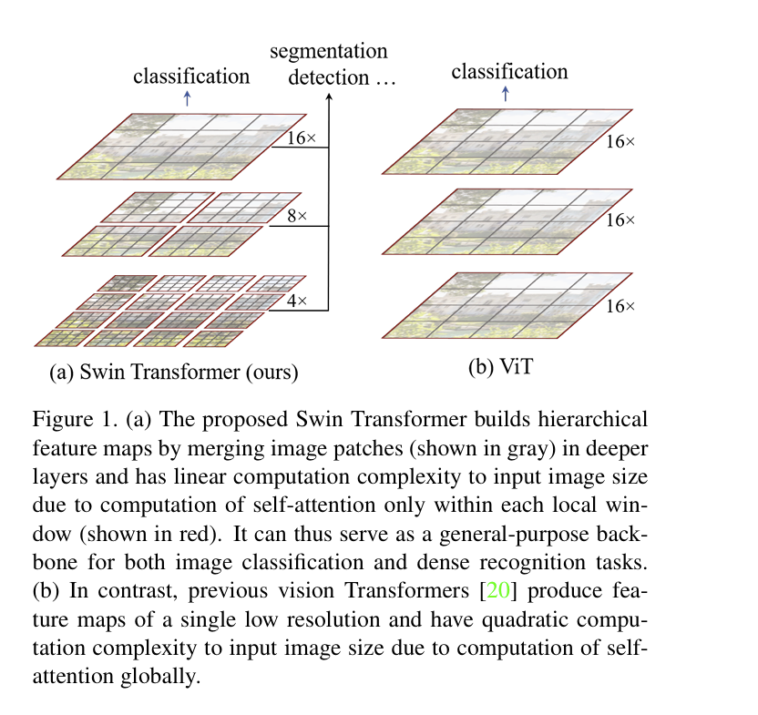
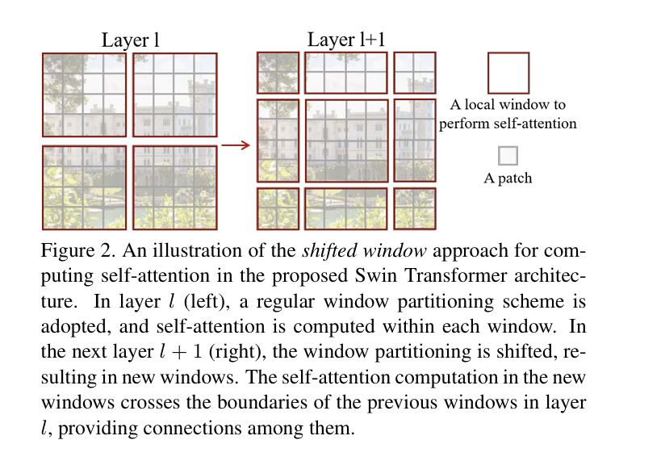

> 更新时间：2024/02/14
# Swin Transformer 论文阅读笔记

 

[论文原文地址](https://arxiv.org/pdf/2103.14030.pdf)
[源代码地址](https://github.com/microsoft/Swin-Transformer)
 
## 引言
 
作者观察到，将Transformer在语言领域的高性能转移到视觉领域的显着挑战可以通过两种模态之间的差异来解释。

 

- 规模差异：在现有的基于Transformer的模型中，tokens都是固定规模的，这种特性不适合这些视觉应用。
 

- 分辨率差异：与文本段落中的单词相比，图像中像素的分辨率要高得多。存在许多视觉任务，如语义分割，需要在像素级别进行密集预测，Transformer对于高分辨率图像来说是难以处理的，因为其自注意力机制的计算复杂度是图像大小的平方。

 

为了克服这些问题，作者提出了一种通用的 Transformer 骨干网，称为 Swin Transformer，它构建了分层特征图，并对图像大小具有线性的计算复杂度。

 

如图1(a)所示，Swin Transformer通过从小尺寸的patches(用灰色表示)开始并在更深Transformer层中逐渐合并相邻patches来构建分层表示。有了这些分层特征映射，Swin Transformer模型可以方便地利用高级技术进行密集预测，如特征金字塔网络(FPN)或U-Net。线性计算复杂度是通过在分割图像(用红色标出)的非重叠窗口内局部计算自关注来实现的。每个窗口的patches数量是固定的，因此复杂度与图像大小成线性关系。这些优点使得Swin Transformer适合作为各种视觉任务的通用主干，与以前基于Transformer的架构形成鲜明对比，后者产生单一分辨率的特征图，具有二次复杂度。

Swin Transformer的一个关键设计是它在连续的自关注层之间窗口分区的移位，如图2所示。移位的窗口桥接前一层的窗口，提供它们之间的连接，显著地增强建模能力。该策略在实际延迟方面也很有效:窗口内的所有query patches共享相同的key set，这有助于硬件中的内存访问。

Swin Transformer在图像分类、目标检测和语义分割等识别任务上取得了较好的性能。

## 方法
### 总体框架
