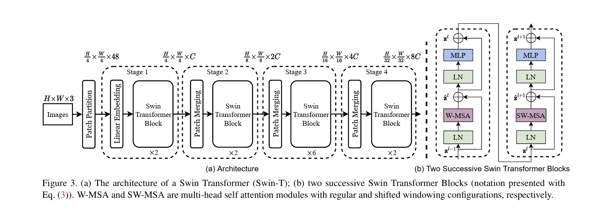

> 更新时间：2024/02/14
# Swin Transformer 论文阅读笔记

 

[论文原文地址](https://arxiv.org/pdf/2103.14030.pdf)
[源代码地址](https://github.com/microsoft/Swin-Transformer)
 
## 引言
 
作者观察到，将Transformer在语言领域的高性能转移到视觉领域的显着挑战可以通过两种模态之间的差异来解释。

 

- 规模差异：在现有的基于Transformer的模型中，tokens都是固定规模的，这种特性不适合这些视觉应用。
 

- 分辨率差异：与文本段落中的单词相比，图像中像素的分辨率要高得多。存在许多视觉任务，如语义分割，需要在像素级别进行密集预测，Transformer对于高分辨率图像来说是难以处理的，因为其自注意力机制的计算复杂度是图像大小的平方。

 

为了克服这些问题，作者提出了一种通用的 Transformer 骨干网，称为 Swin Transformer，它构建了分层特征图，并对图像大小具有线性的计算复杂度。

 

如图1(a)所示，Swin Transformer通过从小尺寸的patches(用灰色表示)开始并在更深Transformer层中逐渐合并相邻patches来构建分层表示。有了这些分层特征映射，Swin Transformer模型可以方便地利用高级技术进行密集预测，如特征金字塔网络(FPN)或U-Net。线性计算复杂度是通过在分割图像(用红色标出)的非重叠窗口内局部计算自关注来实现的。每个窗口的patches数量是固定的，因此复杂度与图像大小成线性关系。这些优点使得Swin Transformer适合作为各种视觉任务的通用主干，与以前基于Transformer的架构形成鲜明对比，后者产生单一分辨率的特征图，具有二次复杂度。

 

Swin Transformer的一个关键设计是它在连续的自关注层之间窗口分区的移位，如图2所示。移位的窗口桥接前一层的窗口，提供它们之间的连接，显著地增强建模能力。该策略在实际延迟方面也很有效:窗口内的所有query patches共享相同的key set，这有助于硬件中的内存访问。

 

Swin Transformer在图像分类、目标检测和语义分割等识别任务上取得了较好的性能。

## 方法

### 总体框架

 
总体框架如图3所示，首先通过patch splitting module(如ViT)将输入的RGB图像分割成不重叠的patch。每个补丁被视为一个“标记”，其特征被设置为原始像素RGB值的串联。在我们的实现中，我们使用4 × 4的patch大小，因此每个patch的特征维数为4 × 4 × 3 = 48。在此原始值特征上应用线性嵌入层，将其投影到任意维度(记为C)。

 

在这些patch tokens上应用了几个具有改进的自关注计算的Transformer块(Swin Transformer块)。Transformer块维护tokens的数量($\frac{H}{4} \times \frac{W}{4}$)，并与线性嵌入一起被称为stage1。

 

为了产生分层表示，随着网络的深入，通过patch合并层来减少tokens的数量。第一个patch合并层将每组2 × 2相邻patches的特征进行拼接，并在拼接后的4C维特征上应用线性层。这将令牌的数量减少了2×2 = 4的倍数(分辨率降低了2倍)，并将输出维度设置为2C。之后应用Swin Transformer块进行特征变换，分辨率保持在$\frac{H}{8} \times \frac{W}{8}$。这第一个块的patch合并和特征转换被称为stage2。该过程重复两次，分别作为stage3和stage4，输出分辨率分别为$\frac{H}{16} \times \frac{W}{16}$和$\frac{H}{32} \times \frac{W}{32}$。

 

***Swin Transformer***是通过将Transformer块中的标准多头自关注(MSA)模块替换为基于移位窗口的模块而构建的，其他层保持不变。如图3(b)所示，Swin Transformer模块由一个基于移位窗口的MSA模块组成，其次是一个2层MLP，中间是GELU非线性。在每个MSA模块和每个MLP模块之前应用一个LN (LayerNorm)层，在每个模块之后应用一个残余连接。

 

### 基于窗口位移的自注意力机制

